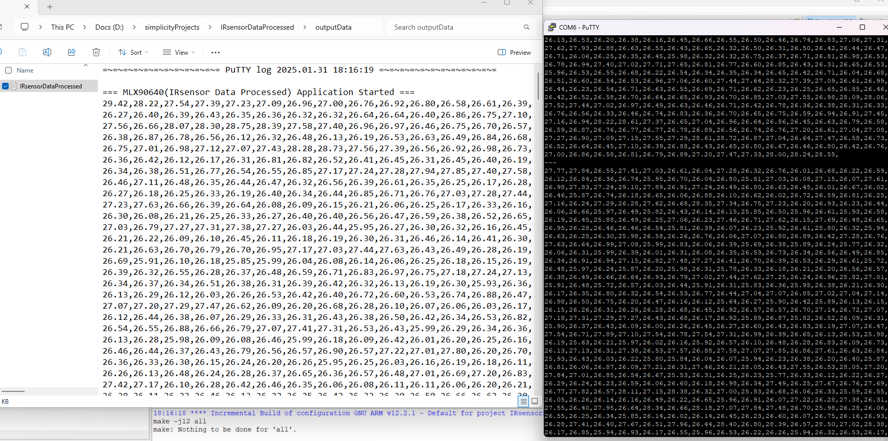

# IRsensor Data Processed
[Reference](https://)


<video controls src="IRsensor Video.gif" title="IRsensor Video"></video>
# 🔥 MLX90640 Thermal Imaging Streamer

Real-time thermal image visualization from the **MLX90640 IR sensor** using Python and Matplotlib. This project reads data via **serial communication (UART)**, processes it, and displays live heatmaps in a continuous stream.

## 🚀 Features
- **Real-time thermal visualization** from the MLX90640 (32x24 pixels).
- **Interactive plotting** using `matplotlib`.
- **Handles incomplete frames & serial errors gracefully**.
- **Supports multiple COM ports** with dynamic selection.
- **User-defined baud rate** for flexible connectivity.

---

## 📦 Installation

### **1️⃣ Install Required Dependencies**
Ensure you have Python installed (**version 3.7+ recommended**), then install the required libraries:

```bash
pip install pyserial numpy matplotlib
```

### **2️⃣ Connect the MLX90640 Sensor**
- Connect the MLX90640 to a **serial interface** (e.g., USB-to-I2C bridge, Raspberry Pi, ESP32, etc.).
- Find the correct **COM port** (Windows) or **serial device** (Linux/Mac).
  
---

## 🛠️ Usage

### **1️⃣ Run the Python Script**
Launch the script:

```bash
python stream.py
```

### **2️⃣ Select Serial Port & Baud Rate**
The script will list all available serial ports. Select the **correct index** and enter the **baud rate** (e.g., `115200`).

```
Available Serial Ports:
0: COM6 - USB Serial Device
1: COM3 - Bluetooth Device

Select the port index: 0
Enter the baud rate: 115200
```

### **3️⃣ View Real-Time Thermal Data**
- The **thermal image updates continuously** when new data is received.
- Each frame is **plotted when "---" is detected** in the serial stream.
- **Press `CTRL+C` to exit** safely.

---

## 🖥️ Project Structure
```
📂 mlx90640-streamer
│── 📜 stream.py         # Main Python script for real-time plotting
│── 📜 README.md         # Documentation
│── 📜 requirements.txt  # Dependencies list
```

---
